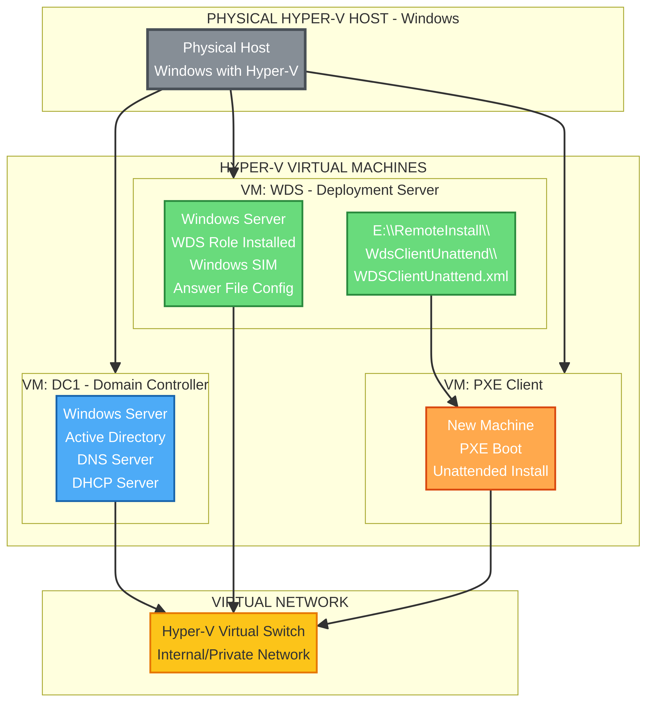
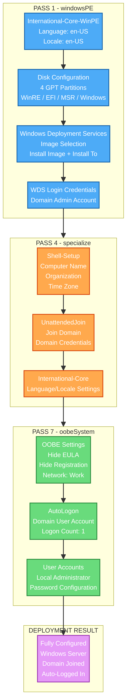
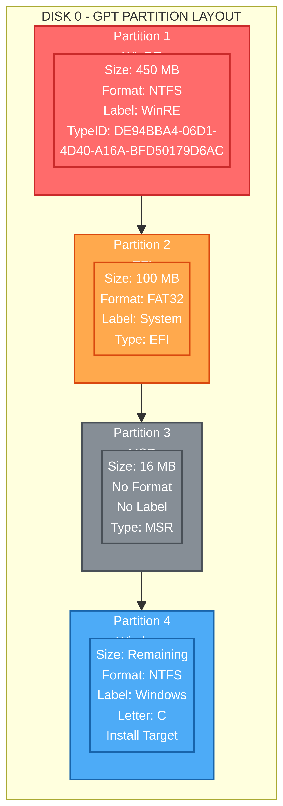
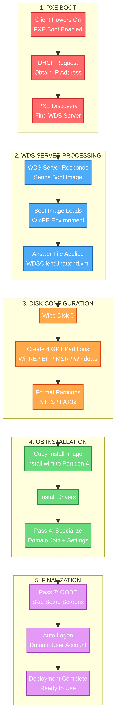

# Assignment 1.6 — Create/Configure the Answer File

## Lab Environment

| Computer | Operating System | Computer Name |
|---|---|---|
| Physical Hyper-V Host | Windows | — |
| Virtual Server | Windows Server | DC1 |
| Virtual Server | Windows Server | WDS |

### Environment Diagram



---

## Table of Contents

1. [Overview](#overview)
2. [Create New Answer File](#step-1--create-new-answer-file)
3. [Pass 1 — windowsPE Configuration](#pass-1--windowspe-configuration)
4. [Pass 4 — Specialize Configuration](#pass-4--specialize-configuration)
5. [Pass 7 — oobeSystem Configuration](#pass-7--oobesystem-configuration)
6. [Validate and Save](#validate-and-save)
7. [PXE Boot Flow](#pxe-boot-flow)
8. [Configuration Files](#configuration-files)

---

## Overview

This lab creates a WDS (Windows Deployment Services) unattended answer file using Windows System Image Manager (SIM). The answer file automates the entire Windows installation process including disk partitioning, OS image selection, domain join, and user account configuration.

### Answer File Passes Overview



---

## Step 1 — Create New Answer File

1. Open **Windows System Image Manager (SIM)**
2. Click **File > New Answer File**
   - The answer file elements display in the Answer File pane
3. **Save the answer file immediately** to:
   ```
   E:\RemoteInstall\WdsClientUnattend\WDSClientUnattend.xml
   ```

---

## Pass 1 — windowsPE Configuration

### Set PE Language/Locale

1. In the bottom-left **Windows Image** pane, expand **Components**
2. Scroll down and right-click on:
   ```
   amd64_Microsoft-Windows-International-Core-WinPE_10.0.16299.15_neutral
   ```
   *(Version number may differ based on OS version)*
3. Choose **Add Setting to Pass 1 windowsPE**

The Microsoft-Windows-International-Core-WinPE component specifies the default language, locale, and other international settings for Windows Setup or WDS installations.

**Set the following values:**

| Setting | Value |
|---|---|
| InputLocale | en-US |
| SystemLocale | en-US |
| UILanguage | en-US |
| UserLocale | en-US |
| SetupUILanguage > UILanguage | en-US |

### Add Disk Configuration to Pass 1

Add **Disk Configuration** and **Windows Deployment Services** to Pass 1. This automates disk partitioning and formatting.

#### GPT Partition Layout (UEFI)



#### Configure Disk

1. Expand **DiskConfiguration** in the Answer File pane
2. Right-click **Disk** > **Insert New Disk**
3. Set values on **Disk[diskID="0"]**:
   - DiskID: `0`
   - WillWipeDisk: `true`

#### Create Partitions (UEFI/GPT — 4 Partitions Required)

Right-click **CreatePartitions** > **Insert New CreatePartition** — repeat 4 times total.

For UEFI/GPT based machines, four partitions are required: WinRE, EFI, MSR, and Windows.

| Partition | Order | Size | Type |
|---|---|---|---|
| **WinRE** | 1 | 450 | Primary |
| **EFI** | 2 | 100 | EFI |
| **MSR** | 3 | 16 | MSR |
| **Windows** | 4 | *(Extend = true)* | Primary |

Select each partition (CreatePartition) in the Answer File pane, starting with the bottom one first, and set the Order, Size, and Type values.

#### Modify Partitions

Right-click **ModifyPartitions** > **Insert New ModifyPartition** — repeat 4 times (one for each partition created).

**WARNING: Only set a value for a setting when told to do so! Leave all other value fields empty.**

**ModifyPartition 1 (WinRE):**

| Setting | Value |
|---|---|
| Format | NTFS |
| Label | WinRE |
| Order | 1 |
| PartitionID | 1 |
| TypeID | DE94BBA4-06D1-4D40-A16A-BFD50179D6AC |

> **Important:** The WinRE partition is the only one requiring a specific TypeID. The ID must be exactly: `DE94BBA4-06D1-4D40-A16A-BFD50179D6AC`

**ModifyPartition 2 (EFI):**

| Setting | Value |
|---|---|
| Format | FAT32 |
| Label | System |
| Order | 2 |
| PartitionID | 2 |

**ModifyPartition 3 (MSR):**

| Setting | Value |
|---|---|
| Order | 3 |
| PartitionID | 3 |

> **Note:** The small 16 MB MSR partition will not be formatted, nor does it get a label.

**ModifyPartition 4 (Windows):**

| Setting | Value |
|---|---|
| Format | NTFS |
| Label | Windows |
| Letter | C |
| Order | 4 |
| PartitionID | 4 |

When done, you should have **four CreatePartition** components to create partitions, and **four ModifyPartition** components to configure them.

### Configure Windows Deployment Services (Pass 1)

#### Image Selection

Expand **Windows Deployment Services > ImageSelection > InstallImage** and enter:

| Setting | Value |
|---|---|
| ImageName | Windows Server 2016 SERVERSTANDARD |
| ImageGroup | ImageGroup1 |
| Filename | install.wim |

> **Note:** This information comes from WDS management console. Use the image name and group that matches your WDS configuration.

#### Install To (GPT Disk)

Select **InstallTo** and set:

| Setting | Value |
|---|---|
| DiskID | 0 |
| PartitionID | 4 |

This tells Windows Setup to install Windows on partition 4 (the Windows partition).

#### WDS Login Credentials

Add your **Domain Admin** user and credentials:

| Setting | Value |
|---|---|
| Domain | YourDomain.com |
| Username | Administrator |
| Password | YourPassword |

> **Important:** Use your own Domain Administrator account credentials, not the example values.

---

## Pass 4 — Specialize Configuration

### Shell-Setup

1. In the Windows Image pane, find:
   ```
   amd64_Microsoft-Windows-Shell-Setup_10.0.16299.15_neutral
   ```
2. **Delete all sub-categories**, leave only the Shell-Setup component
3. Add to **Pass 4 specialize**

**Set the following values:**

| Setting | Value |
|---|---|
| ComputerName | * *(auto-generated)* |
| RegisteredOrganization | YourOrganization |
| RegisteredOwner | YourName |
| TimeZone | Eastern Standard Time |

### UnattendedJoin

1. Add **UnattendedJoin** to Pass 4
2. Configure domain join settings:

| Setting | Value |
|---|---|
| JoinDomain | YourDomain.com |
| Credentials > Domain | YourDomain.com |
| Credentials > Username | Administrator |
| Credentials > Password | YourPassword |

> **Important:** Use your own Domain Admin credentials. Do not use example values.

### Delete Provisioning

Delete the **Provisioning** component — it is not needed.

### International-Core (Language/Locale)

Set the local PC settings for Language/Locale:

| Setting | Value |
|---|---|
| InputLocale | en-US |
| SystemLocale | en-US |
| UILanguage | en-US |
| UserLocale | en-US |

---

## Pass 7 — oobeSystem Configuration

### OOBE Settings

1. Add **OOBE** to Pass 7
2. Configure the following:

| Setting | Value |
|---|---|
| HideEULAPage | true |
| HideLocalAccountScreen | true |
| HideOEMRegistrationScreen | true |
| HideOnlineAccountScreens | true |
| HideWirelessSetupInOOBE | true |
| ProtectYourPC | 1 |
| NetworkLocation | Work |

### User Accounts

1. Add **UserAccounts** to Pass 7

### AutoLogon

1. Add **AutoLogon** to Pass 7
2. In the username field, type any active Domain user account that exists in your environment

| Setting | Value |
|---|---|
| Enabled | true |
| LogonCount | 1 |
| Username | Administrator |
| Domain | YourDomain.com |
| Password > Value | YourPassword |
| Password > PlainText | true |

### Delete Unnecessary Components

- **Delete VMModeOptimizations** — not needed
- **Delete AdministratorPassword** — will be set via LocalAccounts
- **Delete DomainAccounts** — not needed

### Create Local Administrator Account

1. Right-click **LocalAccounts** > **Insert New LocalAccount**
2. This adds a built-in local administrator account

| Setting | Value |
|---|---|
| Name | Administrator |
| Group | Administrators |
| Password > Value | YourPassword |
| Password > PlainText | true |

---

## Validate and Save

1. Click **Tools > Validate Answer File**
2. In the **Messages** pane, make sure there are **no errors**
   - Warnings may appear; they are common and generally acceptable
3. **Save** the answer file to:
   ```
   E:\RemoteInstall\WdsClientUnattend\WDSClientUnattend.xml
   ```

---

## PXE Boot Flow

This diagram shows the complete automated deployment process from PXE boot to a fully configured, domain-joined Windows Server.



---

## Configuration Files

| File | Description |
|---|---|
| `configs/WDSClientUnattend.xml` | Complete WDS unattended answer file (UEFI/GPT) |

The XML answer file in the `configs/` directory contains the full configuration with all three passes (windowsPE, specialize, oobeSystem) pre-configured. **You must replace placeholder values** (YourDomain.com, YourPassword, Administrator) with your actual environment values before use.

### Key Placeholders to Replace

| Placeholder | Replace With |
|---|---|
| `YourDomain.com` | Your actual domain name |
| `YourPassword` | Your domain admin password |
| `Administrator` | Your domain admin username |
| `YourOrganization` | Your organization name |
| `YourName` | Your name |
| `ImageGroup1` | Your WDS image group name |
| `Windows Server 2016 SERVERSTANDARD` | Your actual image name from WDS |
